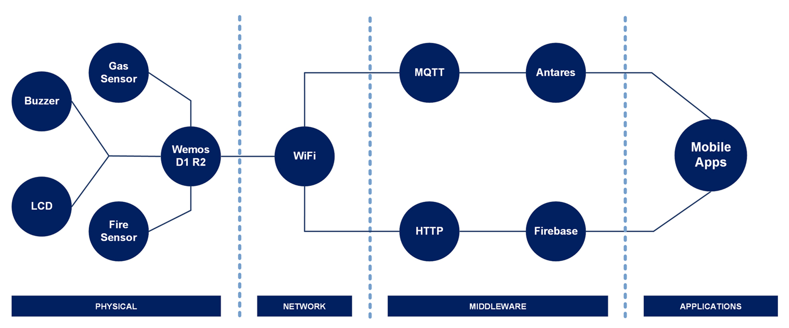

[](https://github.com/ellerbrock/open-source-badges/)
[](https://opensource.org/licenses/MIT)


# Smart Fire-Smoke Detector Berbasis Mobile IoT Apps
<strong>Starting Class to Become a Great IoT Engineer Batch 1</strong><br/><br/>
The increase in population in a country is one of the development capitals. A large population can influence the development of settlements. On the other hand, settlements that are not well regulated can lead to disasters, such as fires. Fire disasters that occur can result in material and immaterial losses. Therefore, the goal of this project is none other than to produce a good fire detection system. This project has been implemented and took approximately 2 weeks. The results show that the system can function properly. The system interface uses the MIT App Inventor application.

<br><br>

## Project Requirements
| Part | Description |
| --- | --- |
| Development Board | Wemos D1 R2 |
| Code Editor | Arduino IDE |
| Application Support | MIT App Inventor |
| Driver | CH340 USB Driver |
| IoT Platform | Antares |
| Communications Protocol | • Inter Integrated Circuit (I2C)<br>• Hypertext Transfer Protocol (HTTP)<br>• Message Queuing Telemetry Transport (MQTT) |
| IoT Architecture | 4 Layer |
| Database |  Firebase |
| Programming Language | C/C++ |
| Arduino Library | • ESP8266WiFi (default)<br>• Wire (default)<br>• AntaresESP8266MQTT<br>• Firebase_Arduino_Client_Library_for_ESP8266_and_ESP32<br>• MQ2_LPG<br>• LiquidCrystal_I2C |
| Actuators | Piezo buzzer (x1) |
| Sensor | • KY-26: Fire Sensor (x1)<br>• MQ-2: Gas Sensor (x1) |
| Display | LCD I2C (x1) |
| Other Components | • Micro USB cable - USB type A (x1)<br>• Jumper cable (1 set)<br>• Breadboard (x1)<br>• Casing box (x1) |

<br><br>

## Download & Install
1. Arduino IDE

   <table><tr><td width="810">

   ```
   https://bit.ly/ArduinoIDE_Installer
   ```

   </td></tr></table><br>

2. CH340 USB Driver

   <table><tr><td width="810">

   ```
   https://bit.ly/CH340_USBdriver
   ```

   </td></tr></table>
   
<br><br>

## Project Designs
<table>
<tr>
<th width="280">Schematic Diagram</th>
<th width="280">Pictorial Diagram</th>
<th width="280">Block Diagram</th>
</tr>
<tr>
<td></td>
<td></td>
<td></td>
</tr>
</table>
<table>
<tr>
<th width="280">Infrastructure</th>
<th width="280">Prototype</th>
<th width="280">Systems Diagram</th>
</tr>
<tr>
<td></td>
<td></td>
<td></td>
</tr>
</table>
<table>
<tr>
<th width="840">Wiring</th>
</tr>
<tr>
<td></td>
</tr>
</table>

<br><br>

## Basic Knowledge
The difference in pinouts on the Wemos D1 R1 and R2 boards is clearly shown in the image below:
<table>
<tr>
<th width="420">Wemos D1 R1</th>
<th width="420">Wemos D1 R2</th>
</tr>
<tr>
<td></td>
<td></td>
</tr>
</table>

<br><br>

## Scanning the I2C Address on the LCD
<table><tr><td width="840">

```ino
/*
  =====================================================
  I2C Scanner for Arduino / ESP32 / ESP8266
  by: Devan Cakra Mudra Wijaya, S.Kom.
  =====================================================

  Functions:
  - Detects all connected I2C devices
  - Displays device addresses in HEX format
  - Displays the total number of detected devices


  =====================================================
  SDA and SCL Pins for Arduino / ESP32 / ESP8266
  =====================================================
  Arduino I2C Connection (default):
  - Arduino Uno / Nano (ATmega328P)
    SDA -> A4
    SCL -> A5

  - Arduino Mega 2560
    SDA -> D20
    SCL -> D21

  - Other Arduino boards
    SDA -> SDA pin
    SCL -> SCL pin
    (Refer to the datasheet or board pinout)

  ESP32 I2C Connection (default):
  SDA -> GPIO 21
  SCL -> GPIO 22

  ESP8266 I2C Connection (default):
  SDA -> GPIO 4 (D2)
  SCL -> GPIO 5 (D1)
*/

// Include the Wire library for I2C communication
#include <Wire.h>

// Constant that defines the delay between scans (5000 ms = 5 seconds)
const uint32_t SCAN_INTERVAL = 5000;


// Function to initialize I2C communication
// SDA and SCL pin configuration will be adjusted automatically based on the board being used
void initI2C() {

  // If the board being used is ESP32:
  #if defined(ESP32)

    // Enable I2C communication
    // SDA = GPIO21
    // SCL = GPIO22
    Wire.begin(21, 22);

  // If the board being used is ESP8266:
  #elif defined(ESP8266)

    // Enable I2C communication
    // SDA = D2 (GPIO4)
    // SCL = D1 (GPIO5)
    Wire.begin(D2, D1);

  // If the board is neither ESP32 nor ESP8266
  // Examples: Arduino Uno, Nano, Mega, Leonardo, etc.
  #else

    // Enable I2C communication using the board's built-in hardware pins
    Wire.begin();

  #endif

}


// The setup() function runs once when the board is powered on or reset
// It is used to initialize hardware, serial communication, sensors, modules, and the program's initial configuration
void setup() {

  // Start Serial communication at 115200 baud rate
  Serial.begin(115200);

  // Check whether the board uses native USB
  // Examples: Arduino Leonardo, Arduino Micro, some ESP32-S2/S3 boards
  #if defined(USBCON) || defined(ARDUINO_USB_CDC_ON_BOOT)

    // If yes:
    // The program will wait until the Serial Monitor is connected before continuing execution
    while (!Serial);

  #endif

  // Wait for 2 seconds before starting the program
  delay(2000);

  // Display program header
  Serial.println("====================================");
  Serial.println("         I2C DEVICE SCANNER         ");
  Serial.println("by: Devan Cakra Mudra Wijaya, S.Kom.");
  Serial.println("====================================");

  // Print an empty line
  Serial.println();

  // Initialize I2C communication
  initI2C();
}


// The loop() function runs continuously after setup() has finished
// The main program logic is typically placed inside this function
void loop() {

  // Variable to store the error code returned from I2C communication
  uint8_t error;

  // Variable to store the I2C address currently being checked
  uint8_t address;

  // Counter variable for the number of detected devices
  uint8_t deviceCount = 0;

  // Display information indicating that the scan process has started
  Serial.println("------------------------------------");
  Serial.println("Scanning I2C bus...");
  Serial.println("------------------------------------");

  // Loop through addresses from 1 to 126
  // Valid I2C addresses range from 0x01 to 0x7E
  for (address = 1; address < 127; address++) {

    // Start communication with the address currently being tested
    Wire.beginTransmission(address);

    // End the transmission and store the result
    // 0 = success
    // 1 = data too long
    // 2 = NACK received when address was sent
    // 3 = NACK received when data was sent
    // 4 = other error
    error = Wire.endTransmission();

    // If no error occurs:
    if (error == 0) {

      // Display information that a device was found
      Serial.print("[FOUND] Device at address 0x");

      // If the address is less than 16:
      // Add a leading zero to keep HEX formatting aligned
      if (address < 16) {
        Serial.print("0");
      }

      // Display the address in HEX format
      Serial.println(address, HEX);

      // Increment the detected device count
      deviceCount++;
    }

    // If an unknown error occurs:
    else if (error == 4) {

      // Display an error message
      Serial.print("[ERROR] Unknown error at address 0x");

      // If the address is less than 16:
      // Add a leading zero to keep HEX formatting aligned
      if (address < 16) {
        Serial.print("0");
      }

      // Display the problematic address in HEX format
      Serial.println(address, HEX);
    }

    // If the error is neither 0 nor 4:
    // Ignore it, as this usually means no device exists at that address
  }

  // Print an empty line
  Serial.println();

  // If no devices were found:
  if (deviceCount == 0) {

    // Display a message indicating that no devices were found
    Serial.println("No I2C devices found.");
  }
  else { // If at least one device was found:

    // Display the total number of detected devices
    Serial.print("Total devices found: ");

    // Display the value of deviceCount
    Serial.println(deviceCount);
  }

  // Display information about the next scan
  Serial.print("Next scan in ");

  // Convert milliseconds to seconds
  Serial.print(SCAN_INTERVAL / 1000);

  // Display the unit in seconds
  Serial.println(" seconds.");

  // Empty line
  Serial.println("\n");

  // Wait 5 seconds before performing the next scan
  delay(SCAN_INTERVAL);
}
```

</td></tr></table><br><br>

## MQ-2 Sensor Calibration for LPG Gas
MQ-2 sensor calibration tutorial for LPG Gas: <a href="https://github.com/cakraawijaya/MQ2_LPG/blob/master/extras/articles/How%20To%20Calibration.md">Click Here</a>

<br><br>

## Arduino IDE Setup
1. Open the ``` Arduino IDE ``` first, then open the project by clicking ``` File ``` -> ``` Open ``` :

   <table><tr><td width="810">
      
      ``` FP_Indobot_DevanCakraMW.ino ```

   </td></tr></table><br>
   
2. Fill in the ``` Additional Board Manager URLs ``` in Arduino IDE

   <table><tr><td width="810">
      
      Click ``` File ``` -> ``` Preferences ``` -> enter the ``` Boards Manager Url ``` by copying the following link :
      
      ```
      http://arduino.esp8266.com/stable/package_esp8266com_index.json
      ```

   </td></tr></table><br>
   
3. ``` Board Setup ``` in Arduino IDE

   <table>
      <tr><th width="810">

      How to setup the ``` WEMOS D1 R2 ``` board
            
      </th></tr>
      <tr><td width="810">
      
      • Click ``` Tools ``` -> ``` Board ``` -> ``` Boards Manager ``` -> Install ``` esp8266 ```.

      • Then selecting a board by clicking: ``` Tools ``` -> ``` Board ``` -> ``` ESP8266 Board ``` -> ``` LOLIN(WEMOS) D1 R2 & mini ```.

      </td></tr>
   </table><br>
   
4. ``` Change the Board Speed ``` in Arduino IDE

   <table><tr><td width="810">
      
      Click ``` Tools ``` -> ``` Upload Speed ``` -> ``` 115200 ```

   </td></tr></table><br>
   
5. ``` Install Library ``` in Arduino IDE

   <table><tr><td width="810">
      
      Download all the library zip files. Then paste it in the: ``` C:\Users\Computer_Username\Documents\Arduino\libraries ```

   </td></tr></table><br>

6. ``` Port Setup ``` in Arduino IDE

   <table><tr><td width="810">
      
      Click ``` Port ``` -> Choose according to your device port ``` (you can see in device manager) ```

   </td></tr></table><br>

7. Change the ``` WiFi Name ```, ``` WiFi Password ```, and so on according to what you are currently using.<br><br>

8. Before uploading the program please click: ``` Verify ```.<br><br>

9. If there is no error in the program code, then please click: ``` Upload ```.<br><br>

10. If there is still a problem when uploading the program, then try checking the ``` driver ``` / ``` port ``` / ``` others ``` section.

<br><br>

## Antares Setup
1. Getting started with Antares :

   <table><tr><td width="810">
      
   • Please <a href="https://beta-console.antares.id/id/signup">Sign Up</a> first.

   • Then please <a href="https://beta-console.antares.id/id">Sign In</a> to access the service.

   </td></tr></table><br>
   
2. Activate Access Key :

   <table><tr><td width="810">
      
   • Go to ``` Account ``` menu.

   • Click ``` Get Access Key ``` to generate an access key. This process only needs to be done once.

   • If you have activated an access key before, skip this step.

   </td></tr></table><br>
   
3. Create applications :

   <table><tr><td width="810">
      
   • Go to ``` Applications ``` menu.

   • Click ``` + Create an Application ```.

   • In the ``` Add Application ``` menu, please specify the following :
      - ``` Application Name ``` -> ``` Name of the App you will create ```.
      - ``` Application ID ``` -> ``` ID of the App you will create ```.
      - ``` Labels ``` -> determine according to project needs.

   </td></tr></table><br>
   
4. Create a device :

   <table><tr><td width="810">
      
   • Make sure you are on the ``` Home / Applications / The app you created ``` menu.

   • Click ``` + Add Device ```.

   • You should specify the name of this device based on the variables in the project.

   </td></tr></table><br>
   
5. Firmware configuration :

   <table><tr><td width="810">
      
   • Make sure you are on the ``` Account ``` menu.

   • Copy ``` Access Key ``` mentioned.

   • Paste in the firmware code, for example like this :

   ```ino
   #define ACCESSKEY "1444e88d02acb758:b996115b1c2f6f0f"
   ```

   • Then, the ``` Project name ``` and ``` Device name ``` must match what was created earlier. For example :
   
   ```ino
   #define projectName "Final_Project_Indobot_Academy_2023"
   #define deviceName "Smart_Fire_Smoke_Detector"
   ```

   </td></tr></table>
   
<br><br>

## Firebase Setup
1. Open the official website ``` Firebase ``` :

   <table><tr><td width="810">
   
   ```
   https://console.firebase.google.com/
   ```

   </td></tr></table><br>
   
2. Create a project with a free name.<br><br>

3. Click ``` gear symbol ``` next to ``` Project Overview ``` -> Then select ``` Project settings ``` to get the ``` FirebaseToken ```.<br><br>

4. Click ``` Realtime Database ``` to get the ``` FirebaseURL ```.

<br><br>

## MIT App Inventor Setup
1. Open the official website ``` MIT App Inventor ``` :

   <table><tr><td width="810">
   
   ```
   https://appinventor.mit.edu/
   ```

   </td></tr></table><br>
   
2. Click ``` Create Apps! ```, then log in using google account.<br><br>

3. Click ``` Project ``` -> then import the files in the ``` Smart-Fire-Smoke-Detector-Berbasis-IoT-Mobile\Src\MIT App Inventor Project\ ``` directory :

   <table><tr><td width="810">

   ``` Smart_Fire_Smoke_Detector.aia ```

   </td></tr></table><br>

4. Click ``` FirebaseDB1 ``` then set the following 3 points:

   <table><tr><td width="810">
      
   • ``` FirebaseToken ``` -> fill with ``` Token ``` obtained from the ``` Project settings ``` section.
   
   • ``` FirebaseURL ``` -> fill with ``` URL ``` obtained from the ``` Realtime Database ``` section.
   
   • ``` ProjectBucket ``` -> fill with ``` DB Container ```. In this case it is ``` Detect ```.

   </td></tr></table><br>

5. Then click ``` Connect ``` -> next select ``` AI Companion ```.<br><br>

6. Open your smartphone, then in the ``` Google Play Store ``` search for the ``` MIT AI2 Companion ``` application, then install it.<br><br>

7. Open the ``` MIT AI2 Companion ``` app.<br><br>

8. Select ``` Scan QR Code ``` method.<br><br>

9. Point your smartphone at the ``` QR Code ``` area on the ``` MIT App Inventor ``` site.

<br><br>

## Get Started
1. Download and extract this repository.<br><br>
   
2. Make sure you have the necessary electronic components.<br><br>
   
3. Make sure your components are designed according to the diagram.<br><br>
   
4. Configure your device according to the settings above.<br><br>

5. Please enjoy [Done].

<br><br>

## Highlights
<table>
<tr>
<th width="210">MIT App Inventor</th>
<th width="210">Device</th>
<th width="210">Firebase</th>
<th width="210">Antares</th>
</tr>
<tr>
<td></td>
<td></td>
<td></td>
<td></td>
</tr>
</table>
<table>
<tr>
<th colspan="2">Simulation of Monitoring with Mobile Apps</th>
</tr>
<tr>
<td width="420"></td>
<td width="420"></td>
</tr>
</table>

<br><br>

## Appreciation
If this work is useful to you, then support this work as a form of appreciation to the author by clicking the ``` ⭐Star ``` button at the top of the repository.

<br><br>

## Disclaimer
This application is my own work and is not the result of plagiarism from other people's research or work, except those related to third party services which include: libraries, frameworks, and so on.

<br><br>

## LICENSE
MIT License - Copyright © 2022 - Devan C. M. Wijaya, S.Kom

Permission is hereby granted without charge to any person obtaining a copy of this software and the software-related documentation files to deal in them without restriction, including without limitation the right to use, copy, modify, merge, publish, distribute, sublicense, and/or sell copies of the Software, and to permit persons receiving the Software to be furnished therewith on the following terms:

The above copyright notice and this permission notice must accompany all copies or substantial portions of the Software.

IN ANY EVENT, THE AUTHOR OR COPYRIGHT HOLDER HEREIN RETAINS FULL OWNERSHIP RIGHTS. THE SOFTWARE IS PROVIDED AS IS, WITHOUT WARRANTY OF ANY KIND, EITHER EXPRESS OR IMPLIED, THEREFORE IF ANY DAMAGE, LOSS, OR OTHERWISE ARISES FROM THE USE OR OTHER DEALINGS IN THE SOFTWARE, THE AUTHOR OR COPYRIGHT HOLDER SHALL NOT BE LIABLE, AS THE USE OF THE SOFTWARE IS NOT COMPELLED AT ALL, SO THE RISK IS YOUR OWN.
